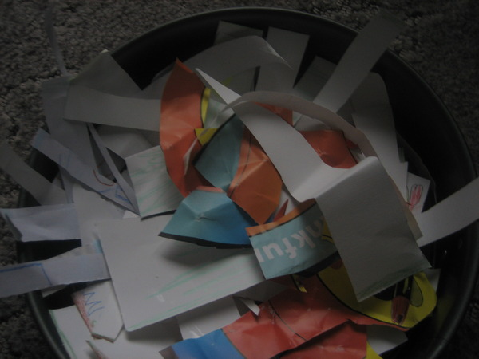
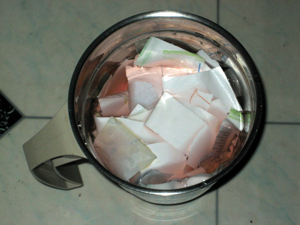
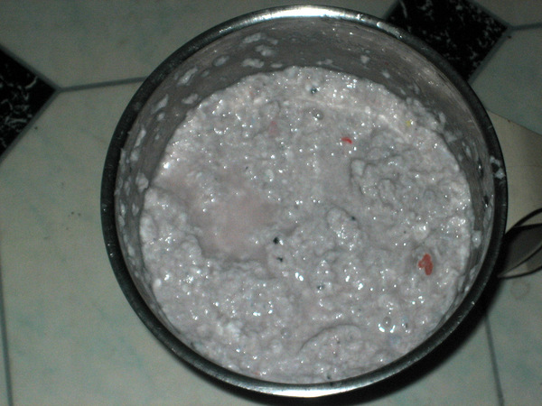
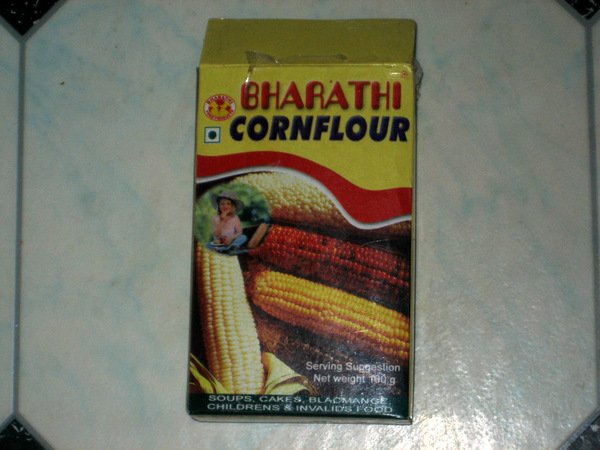
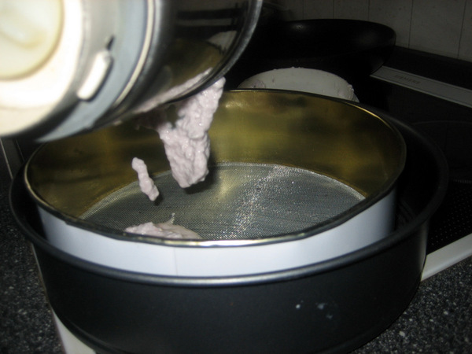
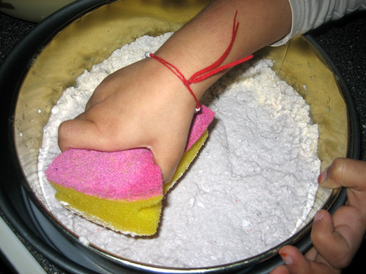
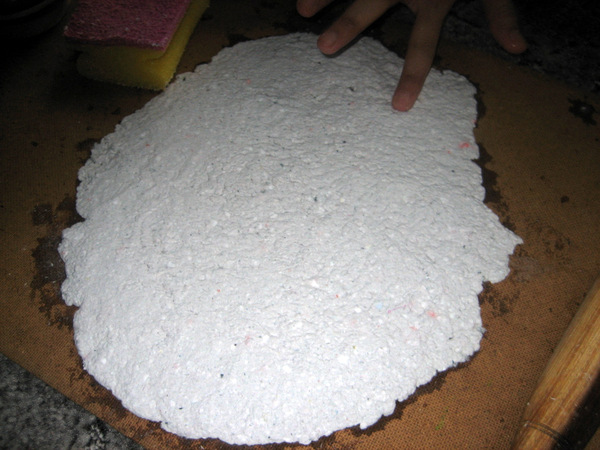
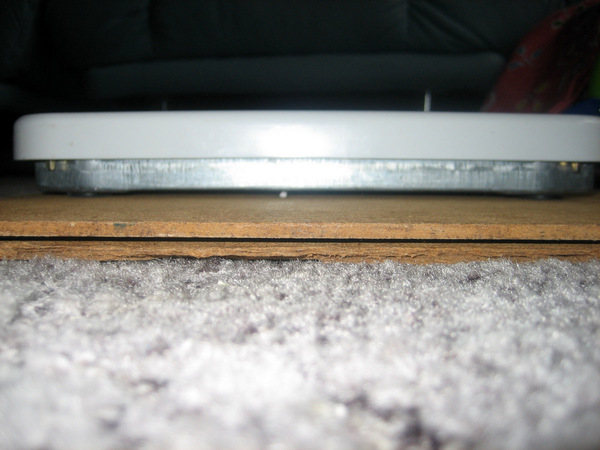

- 
    
    Step !: Shred The Paper
    
- 
    
    Add water to the mix
    
- 
    
    Grind the paper and make a pulp
    
- 
    
    Add some cornflour
    
- 
    
    Empty the mix in a sieve
    
- 
    
    Sponge the mix in the sieve
    
- 
    
    Keep sponging it till the paper has lost its extra moisture
    
- 
    
    Lay the mix out on a wooden plank, and cover it with another
    
- 
    
    Put some heavy weights on the top of the planksLet the paper set.
    

This is a little experiment my dad and I did at home, trying to recycle paper at home, achieving a handmade paper texture to it.  
Thought the paper didn't turn out perfect, I really enjoyed this mini-project of ours!  
Try out the steps in the captions of the images and let me know how your results were!  
~Prachi
