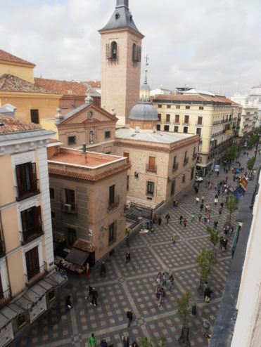

- 
    
    The Royal Palace of Madrid
    
- 
    
    Teatro Real
    
- 
    
    The Monument of Felipe IV
    
- 
    
    Royal Palace
    
- 
    
    Way to the Palace
    
- 
    
    The Opera Subway
    

A few of the Sites we visited in Madrid.

The Teatro Real is a Performing Arts Theatre located very close to the Opera Subway station and the Monument of Felipe IV.  
The Monument of Felipe IV is in front of the entrance to the Royal Palace of Madrid.

The San Jeronimo Roman Cathoic Church.  
Former 1500s monastery with a remodeled Neo-Gothic Sanctuary, with stained glass and a baroque cloister.

The Madrid Atocha Railway Station

Fuente de Neptuno: Neptune Fountain ~A Statue of Neptune on a Shell Shaped Chariot

The Paseo del Prado~ A notable street in Madrid, Adjacent to the Neptune Fountain

The Museo Nacional del Prado

- 
    
- 
    
- 
    

The Museo Nacional del Prado~ Art Museum

- 
    
- 
    
- 
    

_The Plaza Mayor ~ Madrids Vibrant Main Square_

- 
    
- 
    
- 
    
- 
    
- 
    
- 
    
- 
    
- 
    

The State Council
