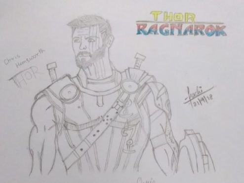

My drawing of thor as portrayed in Thor:Ragnarok

**Thor Odinson** is a fictional superhero appearing in an American comic book published by Marvel Comics The character, which is based on the Norse deity of the same name is the Asgardian god of thunder who possesses the enchanted hammer Mjolnir, which grants him the ability to fly and manipulate the weather.

In the movie **_Thor: Ragnarok_**, Thor is imprisoned on the other side of the universe without his mighty hammer and finds himself in a race against time to get back to Asgard to stop Ragnarok; the destruction of his homeworld and the end of Asgardian civilization; at the hands of an all-powerful new threat, the ruthless Hela. But first he must survive a deadly gladiatorial contest that pits him against his former ally and fellow Avenger--the Incredible Hulk!

This movie is an amazing movie that is a must-watch if you are a Marvel fan! The movie is filled with good fight scenes and good character development.

I hope you like my drawing!!!

~Prachi
