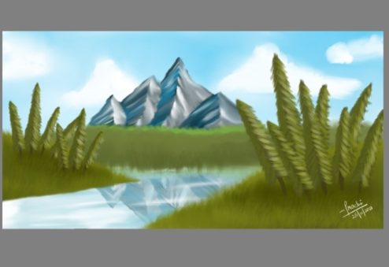

Day 6~ Mountain Scenery

A Serene day near the Himalayas.

This is my first attempt at a Scenic Illustration, and I really like how it turned out!

I am taking less time to complete the art now. Along with drawing these Illustrations, I have started learning different ways to use brushes, as well as the compatibility of colors with each other, and the effects of light.

~ Prachi
